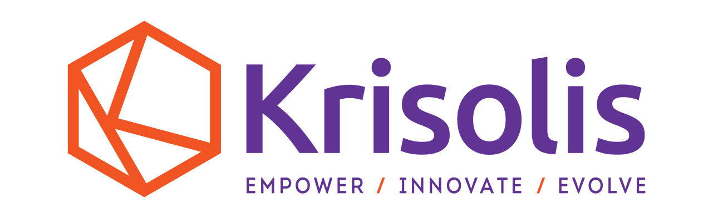

<!-- PROJECT LOGO -->
 

  

<h3 align="center">Krisolis</h3>

  

    Welcome to the Krisolis Organisation GitHub. Krisolis course materials are stored as GitHub repositories.
  

<!-- CONTACT -->
## Contact
If you have any questions or require access to any repositories please contact Eoghan, Alan or Mark.

- Alan Coyne: [@A-Coyne-Krisolis](https://github.com/A-Coyne-Krisolis) 📧 [alan@krisolis.ie](mailto:alan@krisolis.ie)
- Eoghan Staunton: [@Eoghan-Krisolis](https://github.com/Eoghan-Krisolis) 📧 [eoghan@krisolis.ie](mailto:eoghan@krisolis.ie)
- Mark Belford: [@mark-belford](https://github.com/mark-belford) 📧 [mark@krisolis.ie](mailto:mark@krisolis.ie)

(<a href="#readme-top">back to top</a>)

